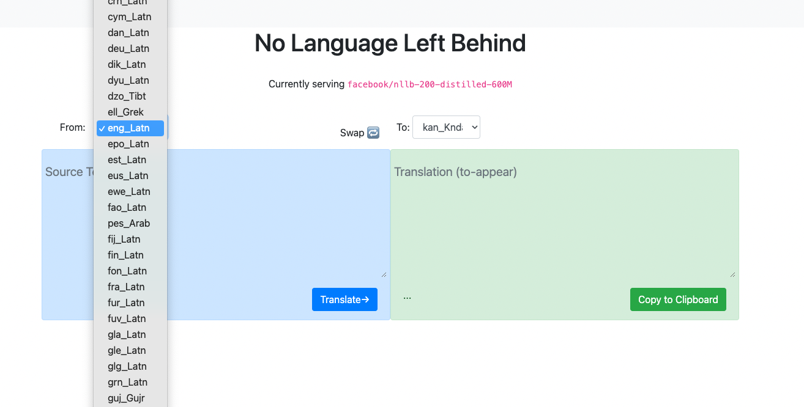

# NLLB Serve

This project offers a web interface and REST API to Meta's No Language Left Behind (NLLB) models that can translate across 200 languages.


## Setup

```bash
git clone  https://github.com/thammegowda/nllb-serve
cd nllb-serve
pip install -e .

# either one of these should work
nllb-serve -h
python -m nllb_serve -h
```

## Start Serving

```bash
# Either one of these should work
nllb-serve
# or
python -m nllb_serve

# Use CPU, ignore GPUs even if they exist
CUDA_VISIBLE_DEVICES= nllb-serve

# Use GPU device 0
CUDA_VISIBLE_DEVICES=0 nllb-serve
```

This starts a service on http://localhost:6060 by default.



**Cuda and Torch Compatibility Issues**
```bash
# check 1:
$ python -c 'import torch; print(torch.cuda.is_available())'
True

# Check 2: match the version of installed cudatookit with the version for which torch bins were compiled
# if exactly matching the versions is not possible/difficult, try getting the versions as close as possible
$ python -c 'import torch; print(torch.version.cuda)'
11.7
$  nvidia-smi  | grep -o 'CUDA.*'
CUDA Version: 12.0
```


**CLI options:**

```
$ nllb-serve -h
usage: nllb-serve [-h] [-d] [-p PORT] [-ho HOST] [-b BASE] [-mi MODEL_ID] [-msl MAX_SRC_LEN]

Deploy NLLB model to a RESTful server

optional arguments:
  -h, --help            show this help message and exit
  -d, --debug           Run Flask server in debug mode (default: False)
  -p PORT, --port PORT  port to run server on (default: 6060)
  -ho HOST, --host HOST
                        Host address to bind. (default: 0.0.0.0)
  -b BASE, --base BASE  Base prefix path for all the URLs. E.g., /v1 (default: None)
  -mi MODEL_ID, --model_id MODEL_ID
                        model ID; see https://huggingface.co/models?other=nllb (default: facebook/nllb-200-distilled-600M)
  -msl MAX_SRC_LEN, --max-src-len MAX_SRC_LEN
                        max source len; longer seqs will be truncated (default: 250)
```

## REST API

* `/translate` end point accepts GET and POST requests with the following args:
  * `source` -- source text. Can be a single string or a batch (i.e., list of strings)
  * `src_lang` -- source language ID, e.g., `eng_Latn`
  * `tgt_lang` -- target language ID, e.g., `eng_Latn`

HTTP Clients may send these parameters in three ways:
1. Query parameters (GET)\
   For example:
   * http://0.0.0.0:6060/translate?source=I%20am%20testing&src_lang=eng_Latn&tgt_lang=fra_Latn
   * http://0.0.0.0:6060/translate?source=I%20am%20testing&src_lang=eng_Latn&tgt_lang=fra_Latn&source=another%20sentence

2. URL encoded form (POST)
  ```bash
   curl --data "source=Comment allez-vous?" --data "source=Bonne journée" \
   --data "src_lang=fra_Latn" --data "tgt_lang=eng_Latn" \
    http://localhost:6060/translate
  ```
3. JSON body (POST)
```bash
$ curl -H "Content-Type: application/json" -X POST \
    http://localhost:6060/translate \
   --data '{"source": ["Comment allez-vous?"], "src_lang": "fra_Latn", "tgt_lang": "kan_Knda"}'
```

List of language codes: https://huggingface.co/facebook/nllb-200-distilled-600M/blob/main/special_tokens_map.json 

## NLLB-Batch

This CLI tool is for decoding batches of data. While the REST API is optimized for translating single translation at once, `nllb-batch` is optmized for decoding a large files.

```
$ nllb-batch  --help
INFO:root:torch device=cuda
usage: nllb-batch [-h] [-mi MODEL_ID] -sl SRC_LANG -tl TGT_LANG [-i INP] [-o OUT] [-msl MAX_SRC_CHARS] [-b BATCH_SIZE]

Serve NLLB model via command line

options:
  -h, --help            show this help message and exit
  -mi MODEL_ID, --model-id MODEL_ID
                        model ID; see https://huggingface.co/models?other=nllb (default: facebook/nllb-200-distilled-600M)
  -sl SRC_LANG, --src-lang SRC_LANG
                        source language identifier; eg: eng_Latn (default: None)
  -tl TGT_LANG, --tgt-lang TGT_LANG
                        Target language identifier; eg: eng_Latn (default: None)
  -i INP, --inp INP     Input file (default: <_io.TextIOWrapper name='<stdin>' mode='r' encoding='utf-8'>)
  -o OUT, --out OUT     Output file (default: <_io.TextIOWrapper name='<stdout>' mode='w' encoding='utf-8'>)
  -msl MAX_SRC_CHARS, --max-src-chars MAX_SRC_CHARS
                        max source chars len; longer seqs will be truncated (default: 512)
  -b BATCH_SIZE, --batch-size BATCH_SIZE
                        Batch size; number of sentences (default: 10)
```

## License

The code and model weights carry different licenses. 
The code in this repository is distributed via [Apache License 2.0](https://www.apache.org/licenses/LICENSE-2.0.html).  
But the model weights are accessed from Huggingface Hub and the original license of model weigts are applicable.
At the time of writing, authors of NLLB model distributed weights via CC-BY-NC-4.0 license. Read more at [LICENSE.model.md](https://github.com/facebookresearch/fairseq/blob/nllb/LICENSE.model.md) and [Creative Commons License](https://en.wikipedia.org/wiki/Creative_Commons_license)


## References
* https://research.facebook.com/publications/no-language-left-behind/
* https://huggingface.co/docs/transformers/main/en/model_doc/nllb
* https://ai.facebook.com/research/no-language-left-behind/
* https://github.com/facebookresearch/fairseq/tree/nllb/
